# mnist-autoencoder

## Description

Autoencoder for MNIST handwritten digits data using Python (Lasagne + Theano library). The main script trains two 'types' of autoencoders.

Training takes about 40 minutes per model, with GPU; special thanks to [National Supercomputing Centre (NSCC) Singapore](http://www.nscc.sg)!  

The main implementation is in ```auto_encoder.py``` which uses helper functions from ```helpers.py```. For plotting validation/training loss see ```plot_training.py```. For visualizations of the code layer, see ```plot_3D.py``` and ```plot_4x4.py``` (for the '3D model' and '4x4 model' respectively). All the output, training information, visualizations and plots are saved/pickled in the 'output' folder. Model weights are supposed to be located in the 'output' folder but due to GitHub uploading restrictions (exceeds 100MB), are *not* provided.


## 3D Model: Autoencoder with 3-dimensional code layer.
### Validation/Training Loss:
<figure>
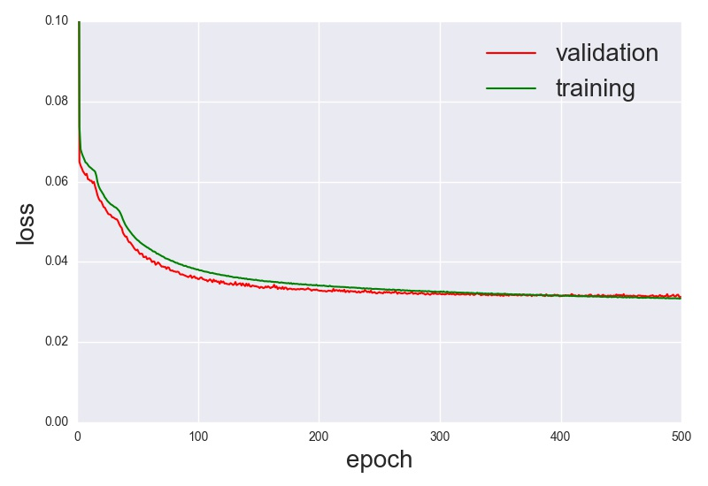
</figure>
### BEFORE:
<figure>
<figcaption>Input</figcaption>
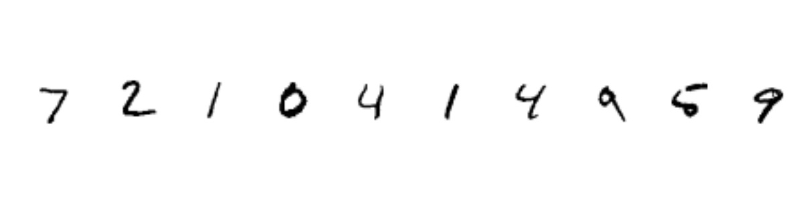
</figure>
<figure>
<figcaption>Output</figcaption>
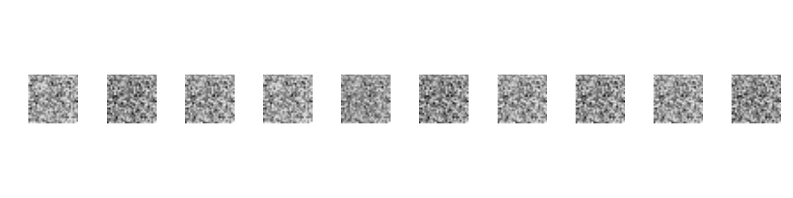
</figure>
<figure>
<figcaption>Code Layer (3D)</figcaption>
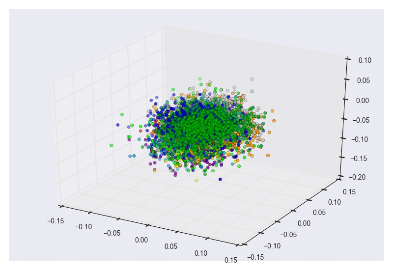
</figure>
<figure>
<figcaption>Code Layer (2D Projections)</figcaption>
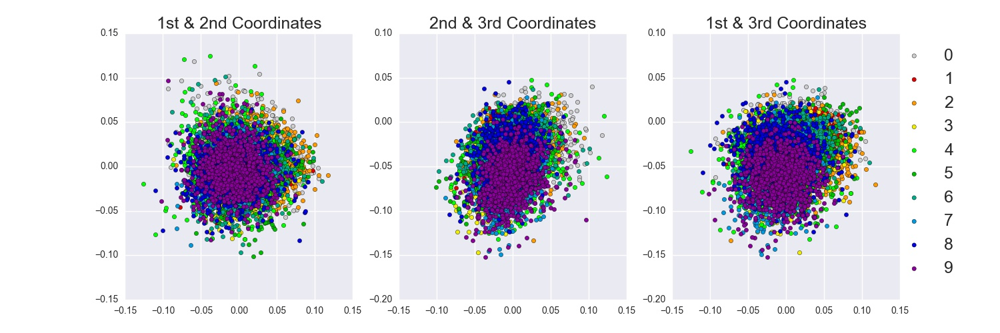
</figure>
### AFTER:
<figure>
<figcaption>Input</figcaption>

</figure>
<figure>
<figcaption>Output</figcaption>
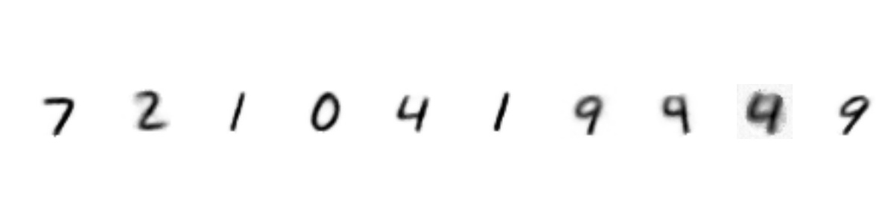
</figure>
<figure>
<figcaption>Code Layer (3D)</figcaption>
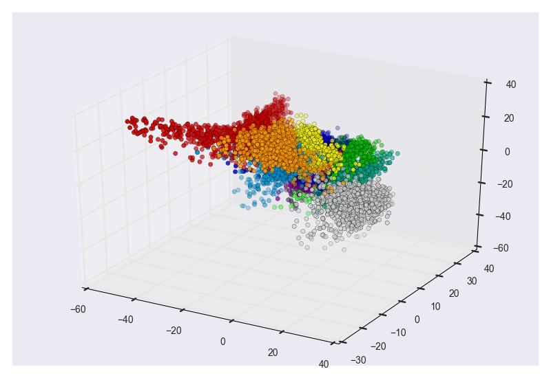
</figure>
<figure>
<figcaption>Code Layer (2D Projections)</figcaption>
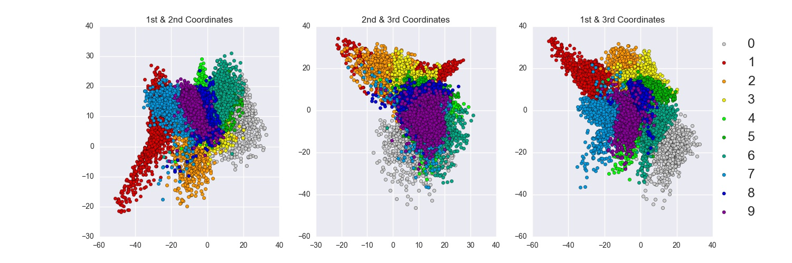
</figure>

## 4x4 Model: Autoencoder with 4x4 image code layer.
### Validation/Training Loss:
<figure>
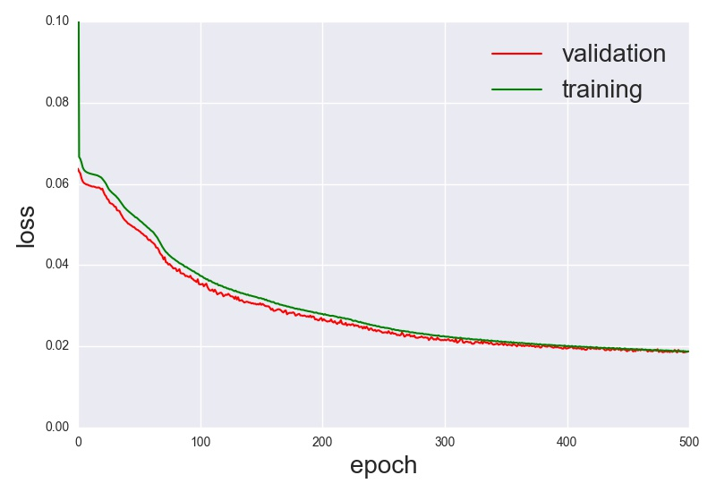
</figure>
### BEFORE:
<figure>
<figcaption>Input</figcaption>

</figure>
<figure>
<figcaption>Encoder</figcaption>
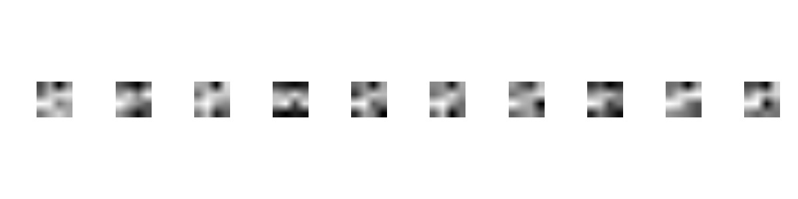
</figure>
<figure>
<figcaption>Decoder</figcaption>
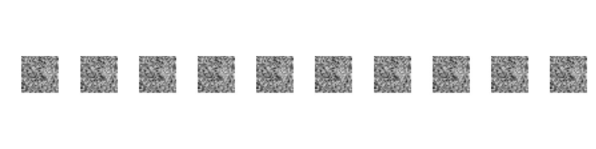
</figure>
### AFTER:
<figure>
<figcaption>Input</figcaption>

</figure>
<figure>
<figcaption>Encoder</figcaption>
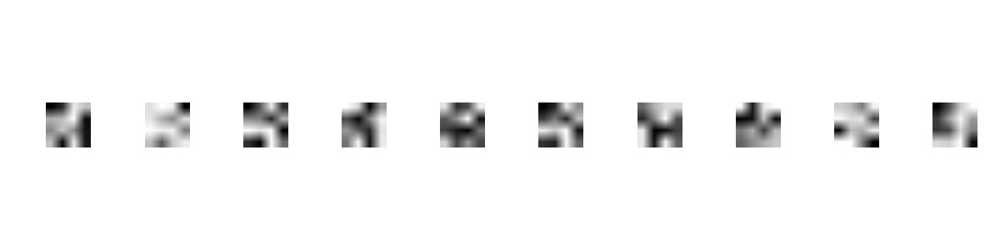
</figure>
<figure>
<figcaption>Decoder</figcaption>
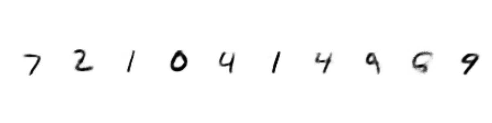
</figure>
<figure>

### References:

[1] Dataset: <http://deeplearning.net/data/mnist/>

[2] Lasagne documentation: <http://lasagne.readthedocs.io/>

[3] Lasagne examples: <https://github.com/Lasagne/Recipes>

[4] Theano documentation: <http://deeplearning.net/software/theano/>

[5] Nikhil Buduma, The Curse of Dimensionality and the Autoencoder: <http://nikhilbuduma.com/2015/03/10/the-curse-of-dimensionality/>
